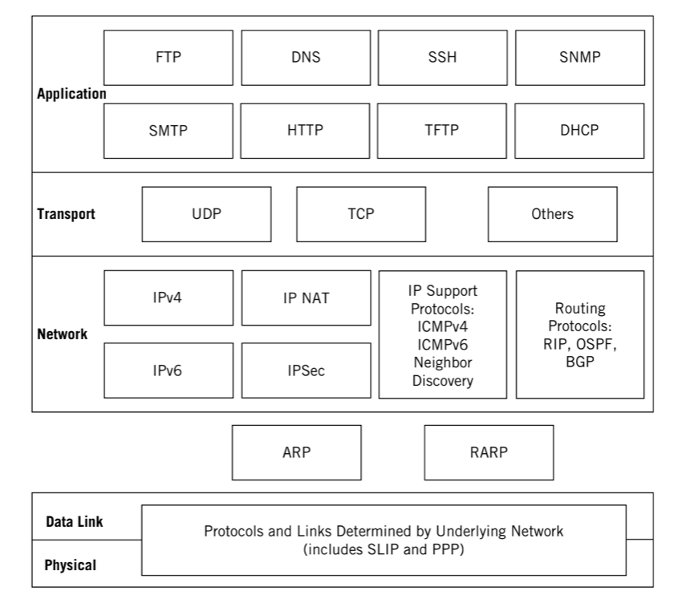

# TCP/IP

## Objective

Understand TCP/IP well enough to set up and run a network. What protocols do and how they work, how addresses and routing are used to move data through the network, and how to set up your network connection.

## TOC

### Introduction

* [Introduction](./introduction)
* [Protocols](./protocols)
* [Internet Administraton](./internet-administration)
* [Layers](./layers)
* [TCP/IP Overview](./tcp-ip-overview)
* [TCP/IP Layers](./tcp-ip-layers)
* [Applications in TCP/IP](./applications)
* [Ports & Sockets](./ports-sockets)
* [Client-Server Model](./client-server)
* [Repeaters, Bridges, Routers, Switches](./essential-devices)
* [Virtual LANs](./vlans)
* [Wireless LANs and IEEE 802.11](./wireless)

### Core Protocols

* [IPv4 and IPv6 Addressing](./protocols/ip)
* [ARP: Address Resolution Protocol](./protocols/arp)
* [ICMP: Internet Control Message Protocol](./protocols/icmp) 
* [Routing](./protocols/routing)
* [IP Forwarding](./protocols/ip-forwarding)
* [UDP: User Datagram Protocol](./protocols/udp)
* [TCP: Transmission Control Protocol](./protocols/tcp)
* [Multiplexing and Sockets](./protocols/multiplexing)

### Routing Protocols

* [Routing and Peering](./protocols/routing/peering)
* [IGPs: RIP, OSPF, and IS-IS](./protocols/routing/igps)
* [BGP: Border Gateway Protocol](./protocols/routing/bgp)
* [Multicast](./protocols/routing/multicast)

### Application Level

* [DHCP: Dynamic Host Configuration Protocol](./protocols/application/dhcp)
* [DNS: Domain Name System](./protocols/application/dns)
* [FTP: File Transfer Protocol](./protocols/application/ftp)
* [SMTP](./protocols/application/smtp)
* [HTTP: Hypertext Transfer Protocol](./protocols/application/http)
* [SSL](https://github.com/herrera-ignacio/cybersecurity_guidelines/tree/master/glossary/encryption/ssl)
* [TLS](https://github.com/herrera-ignacio/cybersecurity_guidelines/tree/master/glossary/encryption/tls)

### Glossary

Frequently use terms that are easily explained without the need of a full chapter about it.

* [DSL & ADSL](./glossary/dsl.md)
* [Ethernet](./glossary/ethernet.md)
* [Host](./glossary/host.md)
* [Intermediate System](./glossary/intermediate-system.md)
* [MAC Address](./glossary/mac-address.md)
* [MPLS](./glossary/mpls.md)
* [Protocol Data Units](./glossary/protocol-data-units.md)
* [Socket](./glossary/socket.md)
* [Sonet](./glossary/sonet.md)
* [System](./glossary/system.md)
* [VPN](./glossary/vpn.md)
