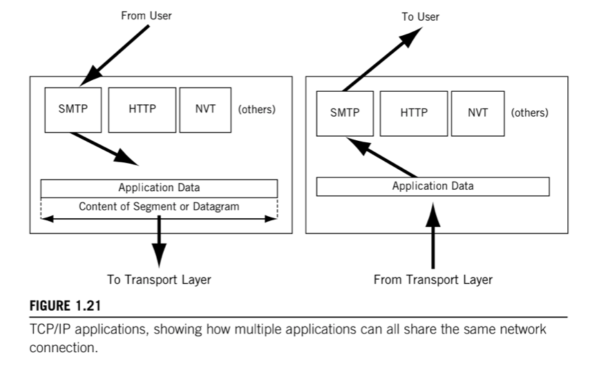

# Applications in TCP/IP

Host TCP/IP implementations typically provide a range of applications that provide users with access to the data handled by the Transport layer protocols.

These applications use a number of protocols that are not part of TCP/IP proper, but are used with TCP/IP. This protocols include _Hyper-Text Transfer Protocol_ (HTTP), _Simple Message Transfer Protocol_ (SMTP), and many others.

The _File Transfer Protocol_ (FTP) in TCP/IP, is at once an Application protocol, service, and an application run by a user.

Some protocols provide separate layers for sessions, internal representation conversion, and application services. In practice, these are seldom implemented independently.

