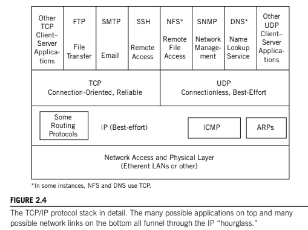

# Client-Server

TCP/IP is considered to be a _peer protocol_ stack, which means that every implementation of TCPIP is considered to have the same capabilities as every other.

Howeer, this does not mean that all protocol stacks function in precisely the same way. TCP/IP, like many other protocol stacks, is __implemented according to a model known as Client-Server model__.

## Reliability

TCP is a _reliable_ layer added on top of the _best-effort_ IP layer, to make sure that even if packets are lost in transit, host will be able to detect and resend missing information. __TCP units are called segments__. It's reliable in the sense that TCP always resends corrupt or lost segments.

UDP is as best-effort as IP itself, and __UDP data units are called datagrams__.

Segments and datagrams are usd to chop up application content, into more easily handled pieces.

## Connection-oriented

TCP is a _connection-oriented layer_ on top of the _conectionless_ IP layer, __because before any TCP segment can be sent to another host, a TCP connection must be established to that host__. Connectionless IP has no concept of a connection, and simply forwards packets without any understanding if the packets ever really got where they were going.

In contrast to TCP, UDP is a connectionless Transport layer. UDP datagrams are simply forwared to a destination under the assumption than sooner or later a response will come back from the remote host.

## Client-Server Model

In the Network Laer, IP is the main protocol and the __IP packet__ (also called _datagram_) gets formed and routed. Above it, the Tansport layer consists of two pajor protocols, _Transmission Control Protocol (TCP)_ and _User Datagram Protocol (UDP)_.

Client-Server application implementation can be extremely simple. A server process can start and basically sit and "listen" for clients to "talk" to the server.

