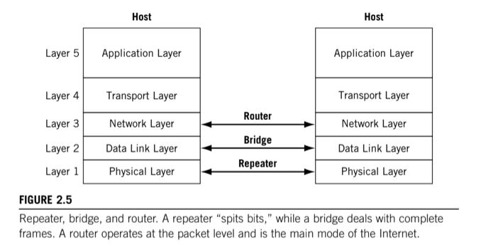
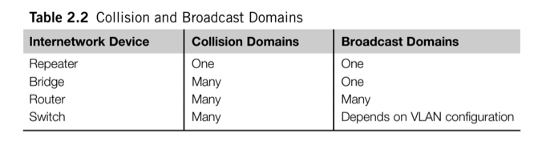

# Repeaters, Bridges, Routers, and Switches

TCP/IP protocol stack establishes an architecture for internetworking. These protocols can be used to connect LANs in the same building, campus, or around the world.

Today, network configurations are growing more and more complex, and the devices available often combine the features of several of these devices.

In their simplest forms, repeaters, bridges, and routers operate at different layers of the TCP/IP Prootocol Stack.

Roughy, __repeaters foward bits__ from one LAN segment to another, __bridges forward frames__, and __routers forward packets__.

## Segmenting LANs

A way to give each user more bandwith, without a wholesale upgrade of hardware, is to _segment_ the LAN. Segmenting does not require replacing all of the user equiment.

It breaks the LAN into smaller portons and then reconnects them with an internetworking device.

A consequence of the different protocol layers at which the various internetworking devices function is the number of LAN collisions and broadcast domains created. Ethernet's CSMA/CD access method can result in collisions when stations on the LAN try to send at almost the same time. Collisions "waste" bandwhith because they destroy the frames, and the colliding stations must wait and try to send again. Even when Ethernets do not generate collisions, broadcast frames must be examined by each receiver because the destination address cannot be used to determine interest in content. Bandwith is wasted if broadcast are sent to systems that have no interest in the content of broadcast message (ARPs for example).

Extending a LAN by forward bits still creates a single collision and broadcast domain.

## Bridges

Ethernet specifications limit the number of systems on a LAN segment and the overall distance spanned. To add devices to a LAN that has reached the maximum in one or both of these categories, a bridge can be used to __connect LAN segments__. Bridges operates at the __Data link layer__.

Bridged networks normally filter frames and do not forward all frames onto all segments connected to the bridges. This is why bridges create more than one collision domain. However, the LAN segments linked by the bridge still normally form one broadcast domain.

The filtering process emplyyed by a bridge differs according to specific LAN technologies. Ethernet uses __transparent bridging__ to connect LAN segments. A transparent bridge looks at the destination MAC address to decide if the frames should be:

* __Forwarded__: frame is sent only onto the LAN segment where the destionation is located. Bridge examines the source MAC address fields to find specific device locations.
* __Filtered__: frame is dropped by the bridge. No message is sent back to the source.
* __Flooded__: frame is sent to every LAN segment attached to the bridge. This is done for broadcast and multicast traffic.

__Media bandwith is shared only by the devices on each segment__. Because the broadcast domain is preserved, the bridged LANs still function as one big LAN. Bridges also discard frames with errors, as well as frames that violate LAN protocol length rules, and thus protect the other LAN segments when things go wrong.

As multicast traffic is flooded, such as ARPs, multimedia applications such as videoconferences can easily overwhelm a bridged network.

## Routers

Routers add functionality to Bridges and operate at the __packet level (Networking layer)__. Routers do not only create more collision domains, they create more LAN broadcast domains as well.

Networking layer addresses in their simplest form consist of a _network_ and a system (_host_) portion of the address. LANs connected by routers have multiple broadcast domains, and each LAG segment belongs to a different subnetwork.

Because of the presence of multiple subnets, TCP/IP devices must behave differently in the presence of a router. Bridges connecting TCP/IP hosts are transparent to the systems, but routers connecting hosts are not.

At the very least, the host must know the address of at least one router, the default router, to send packets beyond the local subnet.

Routers must have a Network layer software to handle whatever layer's protocol are in use on the LAN. Many routers, specially routers that connect to the Internet, can and do understand only the IP protocol.

## LAN Switches

The LAN Switch is really a __complex bridge with many interfaces__. LAN switching is the ultimate extension of multiport bridging. A LAN Switch has every device on its own segment, giving each system the entire media bandwith all for itself.

Multiple systems can transmit simultaneously as long as there are no "port collisions" on the LAN switch. Port collisions occur when multiple source ports try to send a frame to the same output port at the same time.

All of the ports on the switch establish their own broadcast domain. However, when broadcast frames containing ARPs or multicast traffic arrive, the switch floods the frames to all other ports. Unfortunately, this makes LAN switching not much better than a repeater or a bridge when it comes to dealing with broadcast and multicast traffic, with the only difference that broadcast traffic cannot cause collisions that would force retransmissions.

To overcome this problem, a LAN switch can allow multiple ports to be assigned to a broadcast domain. Broadcast domains on a LAN switch are configurable and each floods broadcast and multicast traffic only within its own domain.

When LAN switches define multiple broadcast domains they are creating _Virtual LANs (VLANs)__. A VLAN defines membership to a LAN logically, through configuration, not physically by sharing media or devices. Today, VLANs are extended by use of virtual extensible LANs (VXLANs).

On a _Wide Area Network (WAN)_ the term "switch" means a class of network nodes that behave very differently than routers.
