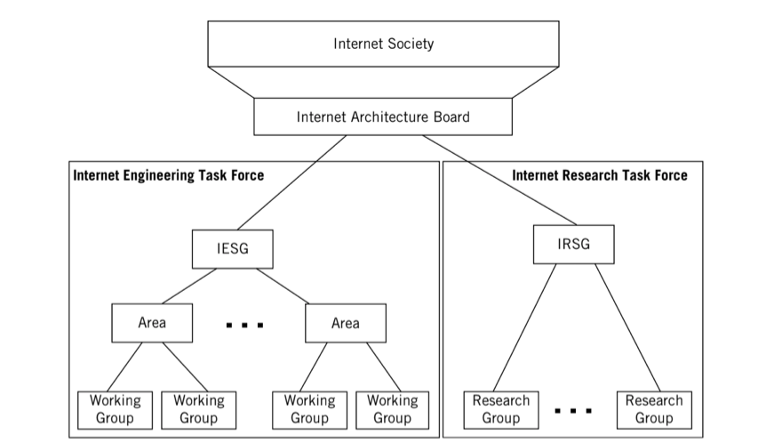

# Internet Administration

## Internet Society (ISOC)

ISOC maintains and supports the other administrative bodies, research and scholarly activities relating the Internet.

## Internet Architecture Board (IAB)

Technical advisor to ISOC.

IAB oversees the continued development of the Internet protocol suite and plays a technical advisory role to members of the Internet community involved in research.

RFC editor derives authority from the IAB, and the IAB represents the Internet to other standards organizations and forums.

## Internet Engineering Task Force (IETF)

Forum of _working groups_ managed by the _Internet Engineering Steering Group_ (IESG).

The IETF identifies operational problem areas and propose solutions. They also develop and review the specifications intended to become Internet standards. The working groups are organized into areas devoted to a particular topic.

Nine areas have been defined, altough this can change:

* Applications
* Internet protocols
* Routing
* Operations
* User services
* Network Management
* Transport
* IPv6
* Security

## Internet Research Task Force (IRTF)

This is another forum of working groups, organized directly under the IESG for management purposes. The IRTF is concerned with long-term research topics related to the Internet protocols, applications, architecture and technology.

## Internet Corporation for ASsigned Names and Numbers (ICANN)

Private nonprofit corporation that is responsible for the management of all Internet _domain names_ and Internet addresses. Before 1998, this role was played by the __Internet Assigned Numbers Authority (IANA)__, which was supported by the U.S government.

## Internet Network Information Center (InterNIC)

Run by the U.S. Department of Commerce, is to collect and distribute information about IP names and addresses.