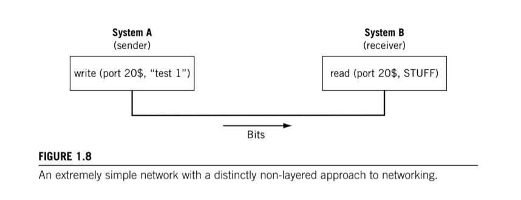

# Layers

The creation of standards can be combined with others to create a working network. Even though no single standards entity has complete control over the entire process from top to bototm. The way this is done is to __divide the communications process up into a number of functional layers__.

Data communications networks rely on _layered protocols_. In brief, processes running on a system and the communication ports that send and receive network bits are logically connected by a series of layers, each performing one major function of the networking task.

The key concept is that __each layer in the protocol stack has a distinct purpose and function__.

There is a big difference between the application layer protocols, such as FTP and SSH, and a lower-level protocol such as Ethernet on a LAN. Each protocol layer handles part of the overall task.

For example, Ethernet cards format the bits sent out on a LAN at one layer, and FTP client software communicates with the FTP server at a higher layer. However, the Ethernet card does not tell the FTP application which bits to send out the interface. FTP addresses the higher-end part of the puzzlie: sending commands and data to the FTP server. Other layers take care of things like formatting, and can vary in capability or form to address differences at every level.

You don't use different Web browsers depending on the type of links used on a network. The whole point is that not all networks are Ethernet, for example, so a layered protocol allows a "_mix and match_" of whatever protocols are needed for the network at each layer. 

## Simple Networking

Most programming languages include statements that allow the programmer to send bits out of a physical connector.

We rapidly come across some problems:

* Is there any link attached to the port at all or are the bits just falling into the "bit bucket"?
* If there was a link attached, what if someone disconnected it while the bits are in flight?
* How would we know that the bits arrived safely?

Even assuming the bits got there...

* How do we know the content makes sense? Some computers store bits differently and content could be garbled on the other system.
* How do we know that a "short integer" used by the sender is the same as the "short integer" used by another?

Every networked application program could conceivably include very line of code needed to solve all of these issues, but that introduces another factor into the networking equaiton. Most hosts attached to a network have only one communications port active at any one time (the _network interface_). If an "all-in-one" network application is using it, perhaps to download a music file, how can another application use the same port for email? It can't.

Besides the need to multiplex in various ways, another factor influencing layers is that modern operating systems do not allow direct access to hardware, rather it's required to go through the OS. Thus leading to a centralization of the networking tasks in the end system.

Protocol layers __make all of these issues easier to deal with, but they cannot be added haphazardly__. As important as the layers are, the tasks and responsibilities assigned to those layers are even _more_ important.
