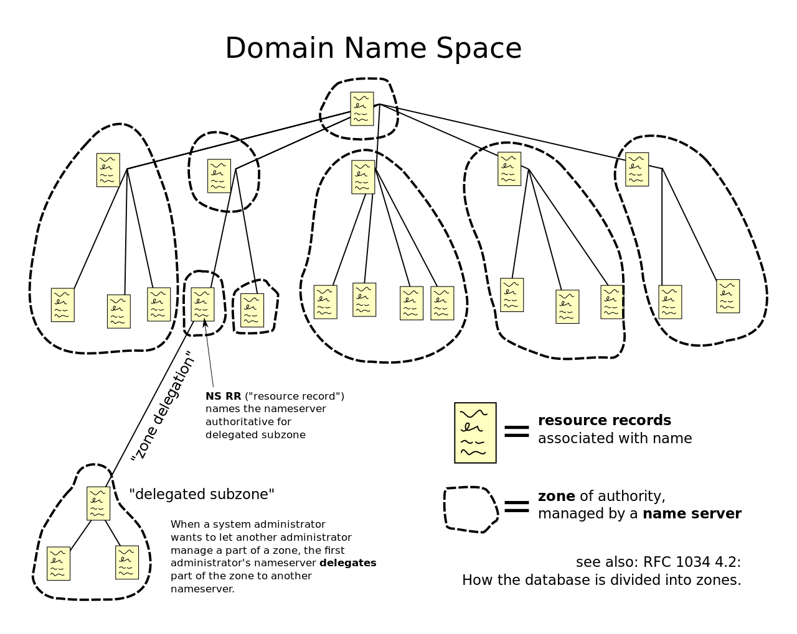
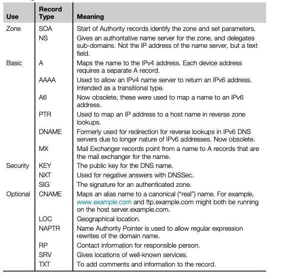

# DNS: Domain Name System

DNS is the __distributed database__ used by the TCP/IP protocol suite to __translate hostnames to IP addresses__ (both IPv4 and IPv6) and provide related information, such as email routing information.

It works as a __hierarchical_ and _descentralized naming system_ for resources connected to the Internet or a private network. It associates various information with domain names assigned to each of the participating entities. Most prominently, it translates more readily memorized domain names to the numerical IP addresses needed for locating and identifying computer services and devices with the underlying network protocols.

Today, the database is distributed because no single site on the Internet knows everyone's hostname and IP address.

## Overview

DNS delegates the responsibility of assigning domain names and mapping thos names to Internet resources by designating __authoritative name servers__ for each domain. Network administrators may delegate authority over sub-domains of their allocated name spaced to other name servers. This mechanism provdes distributed and fault-tolerant service and was designed to avoid a single large central database.

DNS also specifies the technical functionality of the database that is at its core, and DNS protocol, a detailed specification of the data structures and data communication exchanges used in the DNS.

## DNS Hierarchy

DNS Servers are arranged hierarchically. That is, the hundreds of thousands of systems that are _authoritative_ for the FQDNs in their _zone_ are found at the bottom of the DNS _pyramid_.

For ease of maintenance, when two or more DNS servers are involved only one of them is flagged as the primary server for the zone, and the rest become secondary DNS servers. Both are authoritative for the zone.

ISPs typically run their own DNS servers, often for their own customers.

At the top of the pyramid is the _backbone_. There are root servers for the root zone and others for _.com_, _.edu_, and so on.

DNS servers above the local authoritative level refer other name servers to the systems beneath them, and when appropriate each name server will cache information.

Information provided to hosts from any but the authoritative DNS system for the domain is considered _non-authoritative_, a designation not reflecting its reliability but rather its derived nature.

### Authoritative Servers

Authoritative servers can be classified into:

* _Primary_: primary name server for the zone. Find its information locally in a disk file.
* _Secondary_: one more secondary name servers for the zone. They get their information from the primary.
* _Stub_: a special secondary that contains only name server data and not host data.
* _Distribution_: internal or 'stealth' name server known only by IP address.

### Non-Authoritative Servers

Non-authoritative servers (technically, only the _response_ is non-authoritative) can be:

* _Caching_: contain no local zone information. Just caches what it learns from other queries and responses it handles.
* _Forwarder_: performs the queries for many clients. Contains a huge cache.

### Root Name Servers

Root servers stand at the tip of the DNS pyramid are the entry point to the DNS service and rely more on caching than the passive databases that once characterized the root server system.

Current root servers only know which name server a local DNS needs to ask next to resolve a query. So, any query for a _.com_ sent to a root name server produced a list of name servers that might know the naswer.

The continuous caching of these answers means that there is less need to query the root servers after the first query.

## DNS in Theory

DNS consists of three essential components:

* Name server
* Database of DNS resource records
* Resolver

An application interacts with name servers through a resolver. This is an application program that resides on user workstation and sends requests for DNS information when necessary.

Resolvers must be able to find at least one name server, usually the local name server, and local DNS servers provide authoritative answers for local systems. The resolver must also be able to use the information returned by the local name server, if the resource records needed are not local or cached, to pursue the query using referral information leading to other DNS name servers on the Internet.

The resource records of the Domain Name Space are grouped and formatted with a stric tree-structured name space. Information is associated with each type of resource record. The sets of local information (zones) in this structure are distributed among all DNS servers. The name servers essentially answer resolver queries using the information in its zones or from other zones.

Any name server can cache anything it sees about any part of any Internet domain, but generally a particular name server knows only about a tiny fraction of the Internet zones. But there are pointers to other name servers that can be used to answer a resolver query. Name servers can distribute zone information to other name servers to provide redundancy. Finally, DNS name servers periodically refresh their zone information, from local files (primary) or from other name servers (secondaries) through a zone transfer.

Other important DNS concepts are relative name and absolute name (FQDN). A reoslver request for the IP address for the relative name Web server would produce many addresses on many networks around the world. The relative name is part of the complete absolute name, like _webserver.example.com_. Most resolvers step through an ordered list of preconfigured suffixes, append them one at a time to the relative name, and attempt to find the IP address without the absolute name.

DNS uses UDP (port 53), and also TCP for zone transfers between name servers.

## Domain Name Space

Consiste of a tree data structure. Each node or leaf in the tree has a label and zero or more resource records (RR), which hold information associated with the domain name.

The tree sub-divides into zones beginning at the root zone. A DNS zone may consist of only one domain, or many and sub-domains, depending on the administrative choices of the zone manager. DNS can also be partitioned according to class where the separate classes can be thoughs of as an array of parallel namespace trees.

Administrative responsibility for any zone may be divided by creating additional zones.

Authority over the new zone is said to be delegated to a designated server. The parent zone ceases to be authoritative for the new zone.

## Name Servers

DNS is maintained by a __distributed database system, which uses the client-server model__. Nodes of this database are the name servers. Each domain has at least one authoritative DNS server that publishes information about that domain and the name servers of any domains subordinate to it. 

The top of the hierarchy is serverd by the _root name servers_, the servers to query when looking up (resolving) a Top-level domain (TLD), one of the domains at the highest level in hierarchical Domain Name System, for example in the domain name _www.example.com_, the top-level domain is _com_.

Responsibility for management of most top-level domains is delegated to specific organizations by the Internet Corporation for Assigned Names and Numbers (ICANN), which operates the Internet Assigned Numbers Authority (IANA), and is in charge of maintaining the DNS root zone.

## Adress Resolution Mechanism

Domain name resolvers determine the domain name servers responsible for the domain name in question by a sequence of queries starting with the right-most (top-level) domain label.

For proper operation of its domain name resolver, a network host is configured with an initial cache (hints) of the known addresses of the root name servers. These hints are updated periodically by an administrator by retriving a dataset from a reliable source.

In practice, caching is used in DNS servers to off-load the root servers, and as a result, root name servers actually are involved in only a relatively small fraction of all requests.

## DNS Resolvers

Client side of DNS is called a _DNS Resolver_. A resolver is responsible for initiating and sequencing the queries that ultimately lead to a full resolution (translation) of the resource.

Resolvers are classified by a variety of query methods, such as recursive, non-recursive and iterative.

## Adding a new host

Whenever a new host is added to a zone, the DNS administrator must add the resource records to a file on the primary name server. The primary name server is then told to read the confiuration files, and when the secondaries query the primary (typically every 3 hours), the secondaries find newer information on the primary and perform a zone transfer.

The DNS Notify feature enhancesthe basic zone status check and zone transfer mechanisms. This lets the primary server notify the secondaries when the database has changed. A related feature allows part of a zone to be transferred and not the entire zone information.

All local name servers can't find each other, but every name server must be able to find and contact the root name servers on the Internet. Their positions at the top of the DNS pyramid allow the root name servers to answer queries directly from the zone they have loaded.

There's always a chance a user on one side of the world will attempt to contact a server or website that has just been linked to the Internet and has the zone information such as the IP address available only in the local name server on the network with the website.

## Recursive and Iterative queries

DNS queries can be sent out asking for another name server to handle the query recursively or iteratively. 

## Resource Records

DNS databases consists of resource records (RRs) entered into a zone file and loaded onto the authoritative name server. Any other DNS name server can cache this information as a non-authoritative source, and a special reverse zone file is used to enable resolvers to look up a host name by IP address.

## DNSSec

DNS was not designed to be secure.

DNSSec was designed to protect Internet DNS resolvers (clients) from forged DNS data, which can point people looking for a particular website (such as their bank) to the wrong IP address.

However, DNSSec does not say anything about the confidentiality of the data. That is, all DNSSec responses are authenticated but not encrypted.

## Tools

### nslookup

Utility program that allows a user to interact with a DNS name server directly. Considered deprecated, and taken over by dig and host.

### Dig

The Domain Internet Groper (dig) DNS query tool is more general than nslookup, and is often used with other tools. It has a consistent output format that is easily parsed.

### Drill

Similar to dig, but with varying levels of details.
