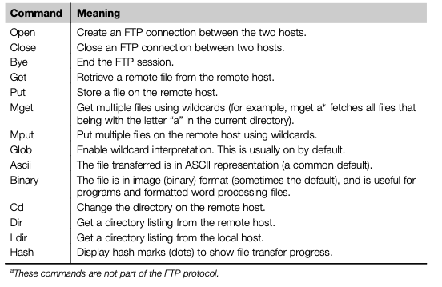

# FTP: File Transfer Protocol

Protocol used for the __transfer of computer files between a client and server on a computer network__.

FTP is built on a client-server model architecture using separate control and data connections between the client and the server.

It is often secured with SSL/TLS (FTPS) or replaced with SSH File Transfer Protocol (SFTP).

## Protocol Overview

FTP may run in _active_ or _passive_ mode using both IPv4 and IPv6, which determines how the data connection is established. In both cases, the client creates a TCP control connection from a random, usually an unpriviliged, port N to the FTP server command port 21.

### Active mode

Client starts listening for incoming data connections from the server on port N. It sends the FTP command PORT M to inform the server on which port it is listening. The server then initiates a data channel to the clien from its port 21, the FTP server data port.

### Passive mode

Useful for situations where the client is behind a firewall and unable to accept incoming TCP connections.

In this mode, client uses the control connection to send a PASV command to the server and then receives a server IP address and server port number from the server, which the client then uses to open a data connection from an arbitrary client port.

## FTP over SSH

FTP over SSH is the practice of tunneling a normal FTP session over a Secure Shell connection. Because FTP uses multiple TCP connections, it is particularly difficut to tunnel over SSH.

With many SSH clients, attempting to set up a tunnel for the control channel (initial client-to-server connection on port 21) will protect only that channel, but when data is transfered, the FTP software at either end sets up new TCP connections and thus have no confidentiality or integrity protection.

## Common Commands

