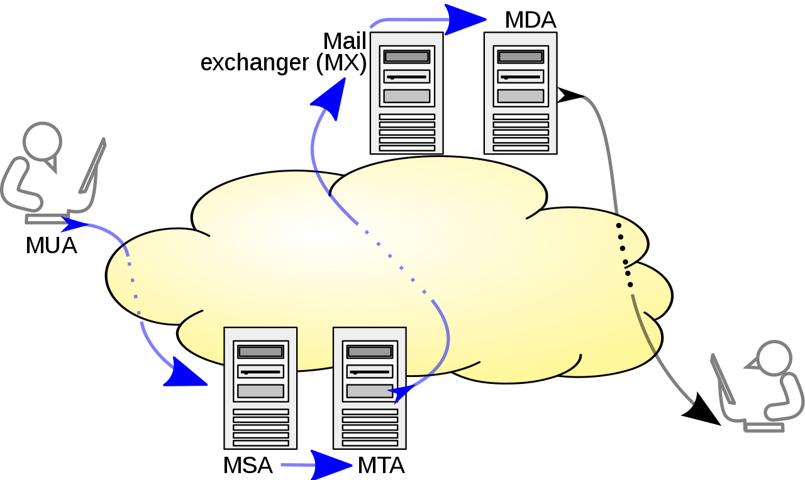

# SMTP: Simple Mail Transfer Protocol

Communication, __connection-oriented, text-based__ protocol for eletronic mail transmission. Mail servers and other message transfer agents use SMTP to send and receive mail messages. Proprietary systems may use non-standard protocols internally, but all use SMTP when sending or receiving email from outside their own systems.

SMTP servers commonly use TCP on port number 25.

User-level email clients typically use SMTP only for sending messages to a mail server for relaying, and typically submit outgoing email to the mail server on port 587 or 465. For retrieving messages, __IMAP__ and __POP3__ are standard, but proprioetary servers also often implement proprietary protocols.

__SMTP defines message transport, not the message content__. Thus, it defines the mail envelope and its parameters, but not the header nor the body of the message itself.

## Mail processing model

Email is submitted by a __Mail Client (Mail User Agent, MUA)__ to a Mail __Server (Mail Submission Agent, MSA)__ using SMTP on TCP port 587. Most mailbox providers still allow submission on traditional port 25.

The MSA delivers the mail to its __Mail Transfer Agent (MTA)__. Often, these two agents are instances of the same software launched with different options on the same pmachine.

The boundary MTA uses DNS to look up the Mail Exchanger Record (MX record) for recipient's domain (the part of the email address on the right of @). The MX record contains the name of the taret host. Based on the target host and other factors, MTA selects and connects to a __Mail Exchanger (MX) server__ as an SMTP client.

Message transfer can occur in a single connection between two MTAs, or in a series of hops trough intermediary systems. A receiving SMTP server may be the ultimate destination, an intermediate 'relay' (stores and forwards the message), or a 'gateway' (forward message using some protocol other than SMTP). Each hop is a formal handoff of responsibility for the message, whereby the receiving server must either deliver the message or properly report the failure to do so.

One the final hop accepts the incoming message, it hands it to a __Mail Delivery Agent (MDA)__ for local delivery.

## Mail retrieval

Once a MDA delivered to the local mail server, it saves messages in the relevant mailbox format, and the mail is stored for batch retrieval by authenticated mail clients (__MUAs__).

Mail is retrieved y end-user applications, called email clients, using __Internet Message Access Protocol (IMAP)__ that both facilitates access to mail and manages stored mail, or the __Post Office Protocol (POP)__ which typically uses the traditional mbox mail file format or a proprietary system such as Microsoft Exchange/Outlook. Webmail clients may use either method, but the retrieval protocol is often not a formal standard.
