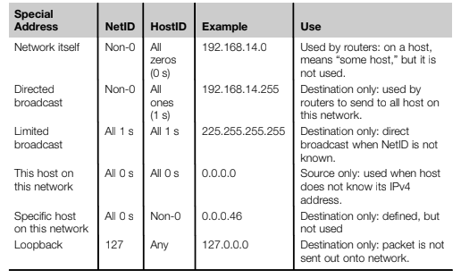

# IPv4 & IPv6 Addressing

Today it is the most common by far to assign IP addresses automatically with the Dynamic Host Configuration Protocol, or DHCP. Routers can use DHCP as well. We’ll look at DHCP in a later chapter.

You can manually assign IP address, using a different interface based on the OS.

## Network/Host Boundary

Allow the network/host boundary in IPv4 and IPv6 addresses to be set almost anywhere (there are still some basic rules). When applied to the former, fixed, IPv4 octet boundaries, if you moved the “natural” boundary of the mask to the right of its normal position, this was called subnet- ting and the address space gets smaller. (Actually, even the older “natural” IPv4 addresses could always be subnetted.) And if you moved the “natural” boundary of the mask to the left of its normal position, this was called supernetting and the address space became larger.

## Public/Private

IP addresses, both IPv4 and IPv6, can be public or private. Public network address spaces are assigned by a central authority and should be unique. Private network addresses are very useful, but are not guaranteed to be unique. Therefore, the use of private network address spaces has to be carefully managed, because routers on the Internet would not work properly if a LAN showed up in two places at the same time. Nevertheless, the use of private address spaces in IP is popular for perceived security reasons. The security aspects are often overempha- sized: The expansion of the locally available address space is the key reason for private address use. (If you have one IP address and three hosts, you have a prob- lem without private addressing.) But private address spaces must be translated to public addresses whenever a packet makes it way onto the global public Internet.

Moreover, private IP addresses are not routable outside a local network, so a router is not allowed to advertise a route to a private address space onto the pub- lic Internet. Note that private addresses are just as routable as public ones within your own network (as on the Illustrated Network), or by mutual consent with another party. They are not generally routable on the global public Internet due to their lack of uniqueness and usual practices.

Almost all networks today rely on private network addresses to prevent public IPv4 address exhaustion, so these addresses are not just to test networks and labs any longer.

## IPv4 Address

The IPv4 address is a network layer concept and has nothing to do with the addresses that the data link layer uses, often called the hardware address on LANs. IPv4 addresses must be mapped to LAN hardware addresses and WAN serial link addresses. However, there is no real relationship between LAN media access control (MAC) or WAN serial link addresses in the frame header and the The IPv4 Address 147 IPv4 addresses used in the packet header, with the special exception of multicast addresses.

The original IPv4 addressing scheme established in RFC 791 is known as classful addressing. The 32 bits of the IPv4 address fall into one of several classes based on the value of the initial bits in the IPv4 address. The major classes used for addresses were A, B, and C. Class D was (and is) used for IPv4 multicast traf- fic, and Class E was “reserved” for experimental purposes. Each class differs in the number of IPv4 address bits assigned to the network and the host portion of the IP address.

### Understanding IPv4 Address

IP addresses and their prefixes are read in a certain way and have special mean- ings depending on how they are written and used. For example, the classful IPv4 address 192.168.19.48 is read as “host 48 on IP network 192.168.19.0.” In a classless environment, as on a router, the prefix length, in this case /24, must be known. Routers often drop trailing zeros, 192.168.19.0/24 is the same as 192.168.19/24, in this case /24 refers to the subnet mask, it indicates the first 24 bits of the address are masked (255.255.255.0), and are part of the Network Number, while the remaining 8 bits are part of the host address, this is known as CIDR format. All IP network addresses must have the bits in the host address field set to 0 and this address cannot be assigned to any host.

## IPv6 Address

IPv6 has been around since about 1995, but the pressure to transition from IPv4 to IPv6 is mostly recent, and comes mainly from network service providers and operators and other roups with large internal networks, such as cellular telephone network operators, as well as aplces with large populations with mobile devices of all kinds, including cars, tablets, and anything that can attach to the IoT.

* An increase in the size of the IP address from 4 bytes (32 bits) to 16 bytes
(128 bits).
* An increase in the size of the IP header from 24 bytes (192 bits) to 40 bytes
(320 bits). (Although aside from the address fields, the header is actually
smaller than in IPv4.)
* Enhanced security capabilities using IPSec (if needed).
* Provision of special “mobile” and autoconfiguration features.
* Provision for support of flows between routers and hosts for interactive
multimedia.
* Inclusion of header compression and extension techniques.

For backward compatibility, all currently assigned public IP addresses are supported as a subset of the IPv6 address space. The IPv6 address size increases the overall IP packet header size (and total TCP/IP overhead) from the current 24 bytes (192 bits) to 40 bytes (320 bits). However, the IPv6 header is much simpler than the IPv4 header.

## Subnetting

Subnetting is done using an IP address mask. The mask is a string of bits as long as the IP address (32 bits in the case of IPv4). If the mask bit is a 1 bit, the corresponding bit in the IP address is part of the network portion of the IP address. If the address bit is part of the host portion, the corresponding mask bit is set to a 0 bit. A mask of 255.255.0.0 means that the first 16 bits of the IP address are part of the network address and the last 16 bits are part of the host portion of the address.

### CIDR and VLSM

Today, the standard methods for moving the network/host address boundary are variable-length subnet masking (VLSM) for host addressing and routing inside a routing domain, and classless interdomain routing (CIDR) for routing between routing domains.

## IP Address Assignment

Most people get IP addresses from their ISP. But where do ISPs get their IP addresses? Large organizations can still apply for their own IP addresses indepen- dent from any ISP. To whom do they apply?

IP addresses (and the Internet domain names associated with them) were ini- tially handed out by the Internet Assigned Number Authority (IANA). Today the Internet Corporation for Assigned Names and Numbers (ICANN), an international nonprofit organization, oversees the process of assigning IP addresses.

Actual IP addresses are handed out by the following Regional Internet Registries (RIRs):

* ARIN (American Registry for Internet Numbers) at www.arin.net—ARIN has handed out IP addresses for North and South America, the Caribbean, and Africa below the Sahara since 1997.
* RIPE NCC (Reseaux IP European Network Coordination Center) at www.ripe. net—RIPE assigns IP addresses in Europe and surrounding areas.
* APNIC (Asian Pacific Network Information Center) at www.apnic.net— APNIC assigns IP addresses in 62 countries and regions in Central Asia, Southeast Asia, Indochina, and Oceania. 168 CHAPTER 5 IPv4 and IPv6 Addressing
* LACNIC (Latin American and Caribbean Network Information Center) at www.lacnic.net—LACNIC assigns IP addresses from ARIN in 38 countries, including Mexico.
* AfriNIC (African Network Information Center) at www.afrinic.net—AfriNIC took over assignment of African IP addresses from ARIN.

All of these Internet Registries databases (who has what IP address space?) combined are known as the __Internet Routing Registry (IRR)__. Internet domain names comprise a related activity, but (like IP addresses) names must be globally unique and (unlike IP addresses) can be almost anything.
