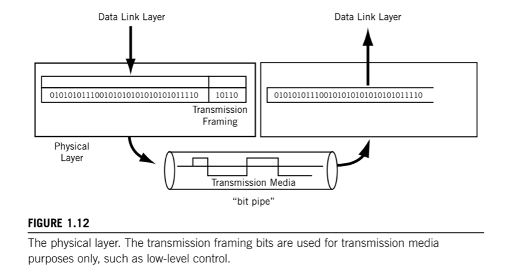
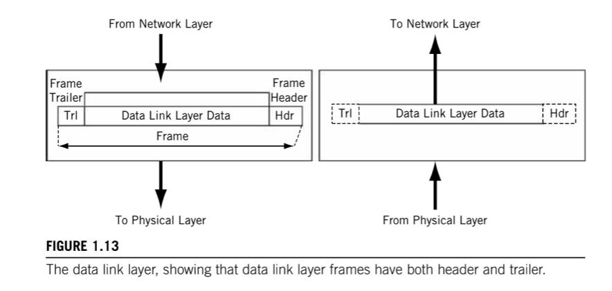
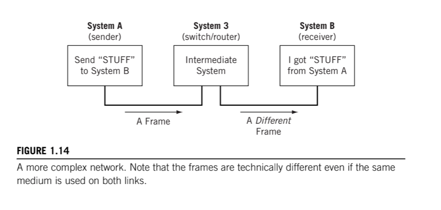
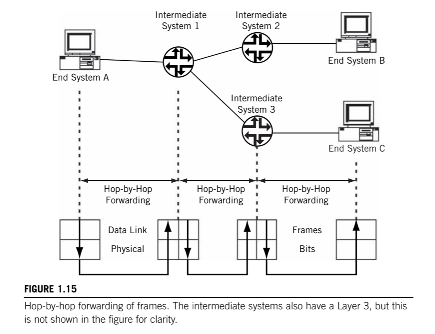
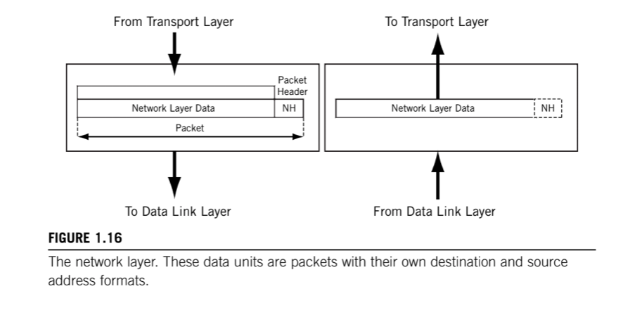
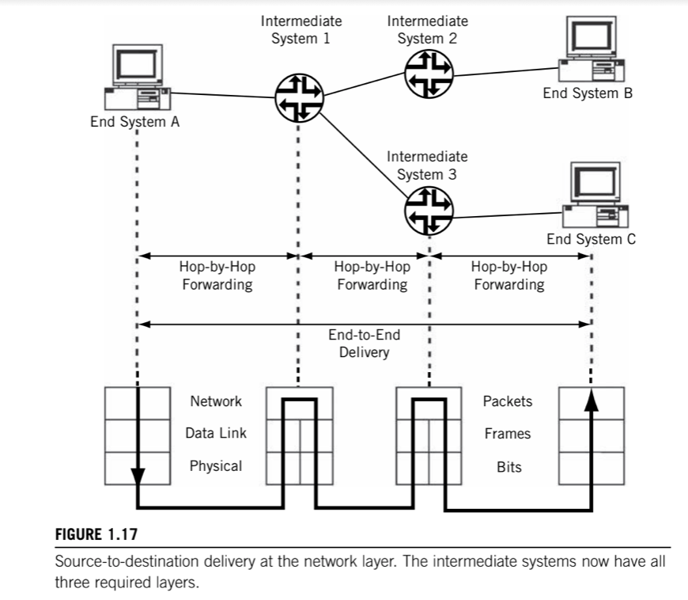
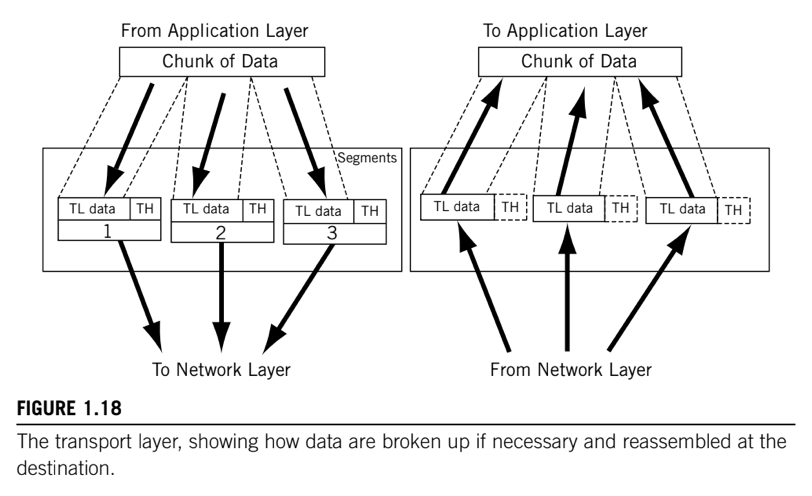
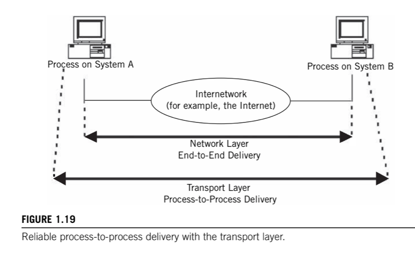
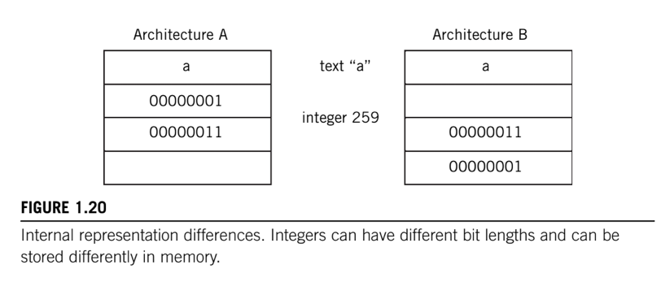

# TCP/IP Layers

From low-level to high-level:

1. __Physical layer__: contains all the functions needed to carry the bit stream over a physical medium to another system.
2. __Data Link layer__: organizes the bit stream into a data unit called a "_frame_" and delivers the frame to an adjacent system.
3. __Network layer__: delivers data in the form of a _packet_ from source to destination, across as many links as necessary, to non-adjacent systems.
4. __Transport layer__: concerned with process-to-process delivery of information.
5. __Application layer__: concerned with differences in internal representation, user interfaces, and anything else that the user required.

## 1. Phyisical layer

> Contains all the functions needed to __carry the bit stream over a physical medium__ to another system.

The transmission medium forms a pure "bit pipe" and should not change the bits sent in any way. Now transmission "on the wire" might send bits through an extremly complex transform, but the goal is to enable the receiver to reconstruct the bit stream exactly as sent.

Some information in the form of _tranmission farming_ can be added to the Data Link layer data, but this is only used by the Physical layer and the transmission medium itself. In some cases, the transmission medium sends a constant idle bit pattern until interrupted by data.

Physical layer specifications have four paths:

* __Mechanical__: specifies the physical size and shape of the connector itself.
* __Eletrical / Optical__: value of voltage or line condition that determines whether a pin is active or what exactly represents a 0 or 1 bit.
* __Functional__: function of each pin or lead on the connector.
* __Procedural__: details the sequence of actions that must take place to send or receive bits on the interface.

There are other things that the physical layer must determine, or be configured to expect:

* __Data/Transmission rate__: number of bits per second that can be sent. It also defines the duration of a symbol on the wire, which usually represent one or more bits.
* __Bit Synchronization__: sender and receiver must be _synchronized_ at the symbol level so that the number of bits expected per unit time is the same.
* __Configuration__: in a multipoint configuration, a link connects more than two devices, and in a multisystem bus/broadcast topology such as LAN, the number of systems can be very high.
* __Topology__: devices can be arranged in a number of ways. In a full _mesh_ topology, all devices are directly connected and _one hop_ away, but this requires a staggering amount of links for even a modest network. Systems can also be arranged as a _star_ topology, with all systems reachable through a central system. There is also the _bus_ and _ring_ topologies.
* __Mode__: So far we only talked about _simplex mode_, where one of the systems acts as a sender and the other as the receiver, a device can only send or receive. More realistic devices use _duplex_ mode, where all systems can send or receive with equal facility. This is often distinguished as _half-duplex_, where a system can send and receive but not at the same time, and _full-duplex_.

## 2. Data Link layer

> Data Link layer performs __framing, physical addressing, and error detection/correction__. This layer also performs __access control__ (determines whose turn it is to send over or control the link) and can perform __flow control__.

Bits are just bits. With only a Physical layer, System A has no way to tell System B "Get ready some bits", "Here are the bits", "Did you get those bits okay?". The Data Link layer solves this problem by __organizing the bit stream into a data unit called a frame__.

It is important to note that frames are the Data Link layer PDUs, and these are not the same as the Physical Layer transmission frames. Transmission frames have control information used to manage the Physical link itself and has little to do directly with _process-to-process_ communications. This "double-frame" arrangement might sound redundant, but many transmission frames originated with voice because digitized voice has no framing at the "Data link" layer.

Data Link layer __moves bits across the link and can add reliability to the raw communications link__. It can be very simple, or make the link appear error-free to the layer above, the Network layer. It usually adds both a _header_ and a _trailer_ to the data presented by the Network Layer.

The frame _header_ typically contains a source and destination address, and some control information passed from one Data Link layer to the other Data Link layer, and not user data. The body of the _frame_ contains the sequence of bits being transferred across the network.

The frame _trailer_ usually contains information used in detecting bit errors (such as _cyclical redundancy checks [CRC]).

A maximum size is associated with the frame that cannot be exceeded because all systems must allocate memory space (buffers) for the data.

This layer also performs __access control__. In LANs, this __Media Access Control (MAC)__ forms a sublayer of the Data Link layer and has its own addressing schme known as _MAC address_.

In addition, this layer can perform some type of __flow control__ that makes sure senders do not overwhelm receivers: a receiver must have adequate time to process the data arriving in its buffers. At this layer, the flow control, if provided, is _link-by-link_. LANs do not usually provide flow control at the data link layer, altough they can.

### Hop-by-Hop Delivery

Not all destination systems are directly reachable by the sender. Directly reachable systems are called __adjacent systems__, and are always "one hop away" from the sender. When the destination system is not directly reachable by the sender, one or more intermediate nodes are needed.

Networking with intermediate systems is called __hop-by-hop delivery__. A "hop" is the usual term used on the Internet or a router network to indicate the __forwarding of a packet between one router or another__.

## Network layer (IP)

> Delivers data in the form of a _packet_ from source to destination, across as many links as necessary, to systems that are not directly connected to the source, performing __fragmentation__ if needed, __routing__ by using __routing tables__ to store information about reachable systems, and __forwarding__ by using those tables for packet delivery.

The biggest difference from the Data Link layer is that the Data Link layer is in charge of data delivery between adjacent systems ("one hop awaay"), while the Network layer __delivers data to systems that are not directly connected to the source__.

How does the network layer know where the packet came from (so the sender can reply)? The key concept at the Network layer is the __network address__, whether an end system or intermediate system. It is important to realize that this network address is __different from, and independent of, the physical address__ used by frames that carry the packets between adjacent systems.

A key issue is how the network addresses "map" to physical addresses, a processes known generally as __address resolution__. In TCP/IP a special family of address resolution protocols takes care of this process. __The network address is a logical address__, and should be organized so that devices can be grouped under a part of that address, in a fashion similar to a telephone number, for example, 212-555-1212 in the North American public switched telephone network (PSTN). The sender need only look at the area code or "network" portion of this address (212) to determine if the destination is local (area codes are the same) or needs to be sent to an intermediate system to react the 212 area code.

In TCP/IP, the network address is the beginning of the device's complete IP address. A group of hosts is gathered under the network portion of the IP address. IP network addresses, like area codes, are globally administered to prevent duplication, while the rest of the IP address is locally administered, often independently.

In some cases, the packet that arrives at an intermediate system inside a frame is too large to fit inside the frame that must be sent out This is not uncommon, different link and LAN types have different maximum frame sizes. The Network layer must be able to __fragment a data unit across multiple frames and eassemble the fragments at the destination__.

Network layer uses one or more __routing tables__ to store information about reachable systems. They must be created, maintained, and purged of old information as the network changes due to failures, addition or deletion of systems and links, or other configuration changes. This whole process is called __routing__, and the use of these tables for packet delivery is called __forwarding__. The __forwarding of packets always takes place hop by hop__.

In a very real sense, the Network layer is at the very heart of any protocol stack, and TCP/IP is no exception. __The protocol at this layer is _IP__, either IPv4 or IPv6.

## Transport layer (TCP & UDP)

> Process-to-Process delivery. _Segmentation_, dividing message content into packets. Makes sure the packets (_message_) arrive in order and intact using flow control and error control. The transport-layer protocol that performs all of these functions is __TCP__.

Getting a packet to the destination system is not quite the same as determining which process should receive the packet's content.

A system can be running file transfer, email, and other network processes all at the same time, and all over a single physical interface. Naturally, the destination process has to know on which process the sender originated the bits inside the packet in order to reply.

Also, systems cannot simply transfer a huge multimegabit file all in one packet. Many data units exceed the maximum allowable size of a packet. The process of dividing message content into packets is known as __segmentation__.

The Network layer forward each and every packet indepdently, and does not recognize any relationship between the packets (is this a file transfer or email packet?). In contrast, the Transport layer can __make sure the whole _message_, often strung out in a sequence of packets, arrives in order__ (packets can be delivered out of sequence) __and intact__ (there are no errors in the entire message). This function involves some method of __flow control__ and __error control__.

The transport-layer protocol that performs all of these functions is __TCP__.

In many cases, the content of the packet forms a complete unit all by itself, called a __datagram__. Self-contained datagrams are not concerned with sequencing or flow control, and these functions are absent in the __User Datagram Protocol (UDP)__ at the Transport layer.

So, there are two very popular protocol packages at the Transport layer:

* __TCP__: connection-oriented, "reliable" service thar provides ordered delivery of packet content.
* __UDP__: connectionless, "unreliable" service that does not provide ordered delivery of packet contents.

In TCP/IP, it is often said that the Network layer (IP itself) offers an "unreliable" service, while the Transport layer adds "reliability" in the form of flow and error control.

> The Network layer gets a single packet to the right system, and the Transport layer gets the entire message to the right process.

Some of the functions that the Transport layer, which in some protocols are defined in a "end-to-end" layer, might include the following:

* __Process/Port addressing and multiplexing__: also known as "_Service-Point Addressing_", decide which process originated the message and to which process the message must be delivered.
* __Segment handling__: in cases where each message is divided into segments, each segment has a sequence number used to put the message back together at the destination.
* __Connection control__: Transport layer can be _connectionless_ which treats every data unit as a self-contained, independent unit, or _connection-oriented_ which goes through a three-phase process every time there is data to send to a destination after an idle period. First, some control messages establish the connection, then the data to be sent, and finally the connection is closed. Generally, segments are conneciton-oriented data units, and datagrams are connectionless data units.
* __Flow control__: prevent senders from overwhelming receivers.
* __Error control__: communications links are not the only source of errors, which can occur inside a system as well.

## Application layer

The TCP/IP protocol stack really stops at the Transport layer (TCP/UDP). It is up to the application programmer to decide what should happen at the client and server level at that point, altough there are individual RFCs for guidance, such as for FTP.

There really isn't such thing in TCP/IP as an Application layer to act as some kind of "glue" between the application's user and the network.

Despite of the lack of a defined layer, a TCP/IP application might still have a lot to do, and in some ways the Application layer is the most complex "layer" of all.

There are two major tasks that the application often needs to accomplish:

* __Session support__.
* __Internal Representation Conversion__.

Not all applications need both, of course, and some applications might not need either.

### Session Support

A _session_ is a type of _dialog controller_ between two processes that establishes, maintains, and synchronizes (controls) the interaction (dialog). A session decides if the communication can be half-duplex (both ends take turns sending) or full-duplex (both ends can send whenever they want).

It also keeps a kind of "history" of the interaction between endpoints, so that when things go wrong or when the two communicate again, some information does not have to be resent.

### Internal Representation Conversion

Its role is to make sure that the data exchange over the network is useful to the receivers.  If the _Internal Representation_ of data differs on the two systems (integer size, bit order in memory, etc.), the Application layer translates between the formats so the application program does not have to.

This layer can also provide _encryption and compression functions_.
