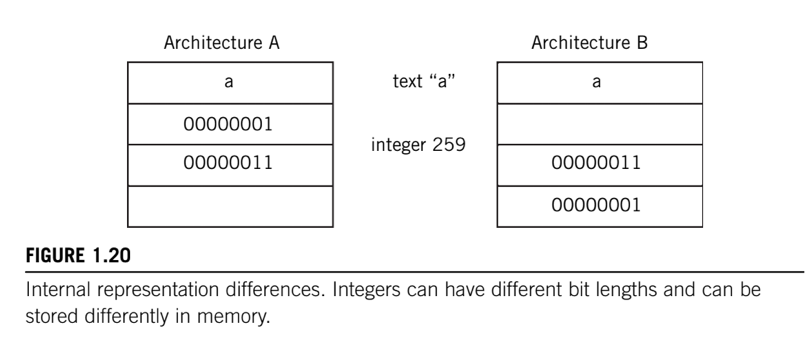

# Application layer

The TCP/IP protocol stack really stops at the Transport layer (TCP/UDP). It is up to the application programmer to decide what should happen at the client and server level at that point, altough there are individual RFCs for guidance, such as for FTP.

There really isn't such thing in TCP/IP as an Application layer to act as some kind of "glue" between the application's user and the network.

Despite of the lack of a defined layer, a TCP/IP application might still have a lot to do, and in some ways the Application layer is the most complex "layer" of all.

There are two major tasks that the application often needs to accomplish:

* __Session support__.
* __Internal Representation Conversion__.

Not all applications need both, of course, and some applications might not need either.

## Session Support

A _session_ is a type of _dialog controller_ between two processes that establishes, maintains, and synchronizes (controls) the interaction (dialog). A session decides if the communication can be half-duplex (both ends take turns sending) or full-duplex (both ends can send whenever they want).

It also keeps a kind of "history" of the interaction between endpoints, so that when things go wrong or when the two communicate again, some information does not have to be resent.

## Internal Representation Conversion

Its role is to make sure that the data exchange over the network is useful to the receivers.  If the _Internal Representation_ of data differs on the two systems (integer size, bit order in memory, etc.), the Application layer translates between the formats so the application program does not have to.

This layer can also provide _encryption and compression functions_.
