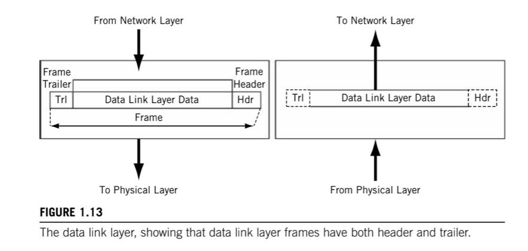
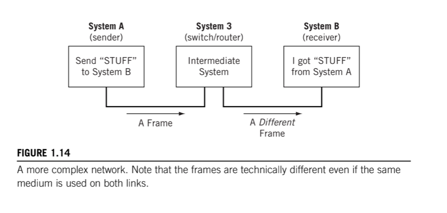
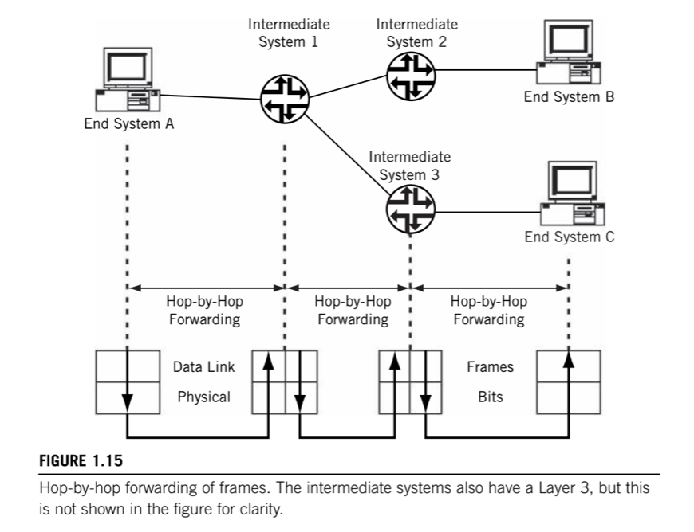

# 2. Data Link layer

> Data Link layer performs __framing, physical addressing, and error detection/correction__. This layer also performs __access control__ (determines whose turn it is to send over or control the link) and can perform __flow control__.

Bits are just bits. With only a Physical layer, System A has no way to tell System B "Get ready some bits", "Here are the bits", "Did you get those bits okay?". The Data Link layer solves this problem by __organizing the bit stream into a data unit called a frame__.

It is important to note that frames are the Data Link layer PDUs, and these are not the same as the Physical Layer transmission frames. Transmission frames have control information used to manage the Physical link itself and has little to do directly with _process-to-process_ communications. This "double-frame" arrangement might sound redundant, but many transmission frames originated with voice because digitized voice has no framing at the "Data link" layer.

Data Link layer __moves bits across the link and can add reliability to the raw communications link__. It can be very simple, or make the link appear error-free to the layer above, the Network layer. It usually adds both a _header_ and a _trailer_ to the data presented by the Network Layer.

The frame _header_ typically contains a source and destination address, and some control information passed from one Data Link layer to the other Data Link layer, and not user data. The body of the _frame_ contains the sequence of bits being transferred across the network.

The frame _trailer_ usually contains information used in detecting bit errors (such as _cyclical redundancy checks [CRC]).

A maximum size is associated with the frame that cannot be exceeded because all systems must allocate memory space (buffers) for the data.

This layer also performs __access control__. In LANs, this __Media Access Control (MAC)__ forms a sublayer of the Data Link layer and has its own addressing schme known as _MAC address_.

In addition, this layer can perform some type of __flow control__ that makes sure senders do not overwhelm receivers: a receiver must have adequate time to process the data arriving in its buffers. At this layer, the flow control, if provided, is _link-by-link_. LANs do not usually provide flow control at the data link layer, altough they can.

## Hop-by-Hop Delivery

Not all destination systems are directly reachable by the sender. Directly reachable systems are called __adjacent systems__, and are always "one hop away" from the sender. When the destination system is not directly reachable by the sender, one or more intermediate nodes are needed.

Networking with intermediate systems is called __hop-by-hop delivery__. A "hop" is the usual term used on the Internet or a router network to indicate the __forwarding of a packet between one router or another__.

