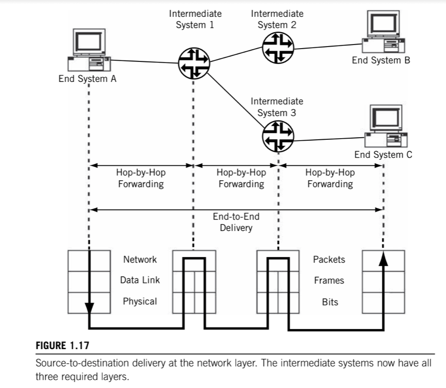

# Network layer (IP)

> Delivers data in the form of a _packet_ from source to destination, across as many links as necessary, to systems that are not directly connected to the source, performing __fragmentation__ if needed, __routing__ by using __routing tables__ to store information about reachable systems, and __forwarding__ by using those tables for packet delivery.

The biggest difference from the Data Link layer is that the Data Link layer is in charge of data delivery between adjacent systems ("one hop awaay"), while the Network layer __delivers data to systems that are not directly connected to the source__.

How does the network layer know where the packet came from (so the sender can reply)? The key concept at the Network layer is the __network address__, whether an end system or intermediate system. It is important to realize that this network address is __different from, and independent of, the physical address__ used by frames that carry the packets between adjacent systems.

A key issue is how the network addresses "map" to physical addresses, a processes known generally as __address resolution__. In TCP/IP a special family of address resolution protocols takes care of this process. __The network address is a logical address__, and should be organized so that devices can be grouped under a part of that address, in a fashion similar to a telephone number, for example, 212-555-1212 in the North American public switched telephone network (PSTN). The sender need only look at the area code or "network" portion of this address (212) to determine if the destination is local (area codes are the same) or needs to be sent to an intermediate system to react the 212 area code.

In TCP/IP, the network address is the beginning of the device's complete IP address. A group of hosts is gathered under the network portion of the IP address. IP network addresses, like area codes, are globally administered to prevent duplication, while the rest of the IP address is locally administered, often independently.

In some cases, the packet that arrives at an intermediate system inside a frame is too large to fit inside the frame that must be sent out This is not uncommon, different link and LAN types have different maximum frame sizes. The Network layer must be able to __fragment a data unit across multiple frames and eassemble the fragments at the destination__.

Network layer uses one or more __routing tables__ to store information about reachable systems. They must be created, maintained, and purged of old information as the network changes due to failures, addition or deletion of systems and links, or other configuration changes. This whole process is called __routing__, and the use of these tables for packet delivery is called __forwarding__. The __forwarding of packets always takes place hop by hop__.

In a very real sense, the Network layer is at the very heart of any protocol stack, and TCP/IP is no exception. __The protocol at this layer is _IP__, either IPv4 or IPv6.

## Operational Aspects

This "_conectionless_ IP layer" routes the IP packets independently through the collection of network nodes. Packets at the IP layer do not follow "paths" or "virtual circuits", this also means that the packets' content might arrive at the destination out of sequence, or even with gaps due to lost packets.

IP does not care to which application a packet belongs. IP delivers all packets wihout a sense of priority or sensitivity to loss. The whole point of IP is to get packets from one network interface to another, and is not concerner with the lack of guaranteed _quality of service_ (QoS) parameters such as bandwith availability or minimal delay.

Two other protocols run at the IP layer besides IPv4 or IPv6.

### ICMP

Routers that form the network nodes ina TCP/IP network must be able to __send error messages to the hosts if a router must discard a packet__ (e.g. due to lack of buffer space because of congestion). This protocol is known as the __Internet Control Message Protocol (ICMP)__. ICPM messages are sent inside IP packets.

### ARP

The other major protocol placed at this layer has many different functions depending on the type of network that IP is running on. This is the __Address Resolution Protocol (ARP)__. The main function of ARP is to provide a method for IPv4, which technically knows only about packets, to __find out the proper Network layer address to place in the frame header destination field__. On LANs, this is the MAC address. Without this address, the network beneath the IP layer could not deliver the frame containing the IP packet to the proper destination. IPv6 does not use ARP, rather it uses multicast for this purposes.

On a LAN, ARP is a way for IPv4 to send a broadcast message onto the LAN asking, "Who has IP address xxx?". Each system on the LAN, wether host or router will examine the ARP message and the system having the IP address in question will reply to the sender's MAC address found in the source field of the frame. This target system will also cache the IP address information so that it knows the MAC address of the sender (cutting down ARP traffic on the network). And the MAC address needed by the sending system is found in the source address field of the frame carrying the ARP reply packet.
