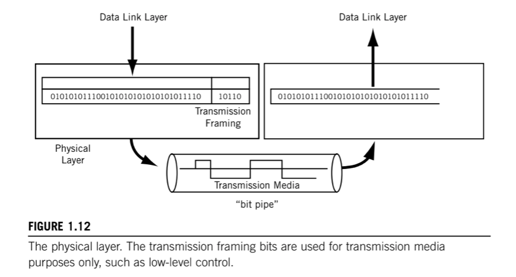

# 1. Phyisical layer

> Contains all the functions needed to __carry the bit stream over a physical medium__ to another system.

The transmission medium forms a pure "bit pipe" and should not change the bits sent in any way. Now transmission "on the wire" might send bits through an extremly complex transform, but the goal is to enable the receiver to reconstruct the bit stream exactly as sent.

Some information in the form of _tranmission farming_ can be added to the Data Link layer data, but this is only used by the Physical layer and the transmission medium itself. In some cases, the transmission medium sends a constant idle bit pattern until interrupted by data.

Physical layer specifications have four paths:

* __Mechanical__: specifies the physical size and shape of the connector itself.
* __Eletrical / Optical__: value of voltage or line condition that determines whether a pin is active or what exactly represents a 0 or 1 bit.
* __Functional__: function of each pin or lead on the connector.
* __Procedural__: details the sequence of actions that must take place to send or receive bits on the interface.

There are other things that the physical layer must determine, or be configured to expect:

* __Data/Transmission rate__: number of bits per second that can be sent. It also defines the duration of a symbol on the wire, which usually represent one or more bits.
* __Bit Synchronization__: sender and receiver must be _synchronized_ at the symbol level so that the number of bits expected per unit time is the same.
* __Configuration__: in a multipoint configuration, a link connects more than two devices, and in a multisystem bus/broadcast topology such as LAN, the number of systems can be very high.
* __Topology__: devices can be arranged in a number of ways. In a full _mesh_ topology, all devices are directly connected and _one hop_ away, but this requires a staggering amount of links for even a modest network. Systems can also be arranged as a _star_ topology, with all systems reachable through a central system. There is also the _bus_ and _ring_ topologies.
* __Mode__: So far we only talked about _simplex mode_, where one of the systems acts as a sender and the other as the receiver, a device can only send or receive. More realistic devices use _duplex_ mode, where all systems can send or receive with equal facility. This is often distinguished as _half-duplex_, where a system can send and receive but not at the same time, and _full-duplex_.
