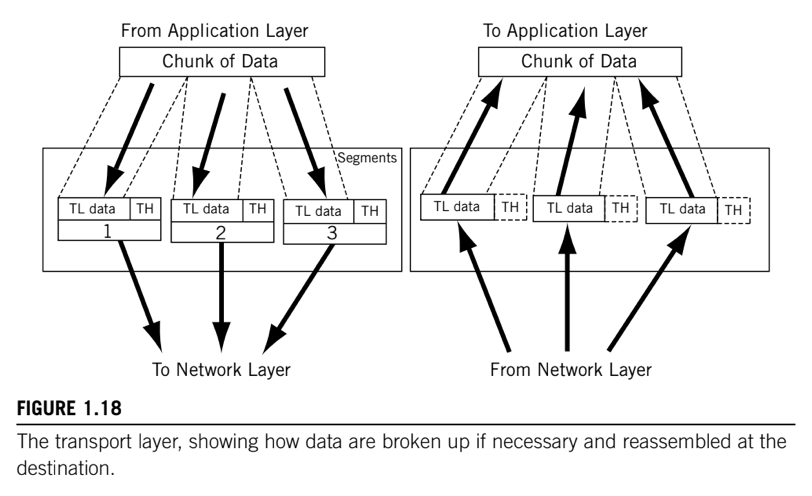

# Transport layer (TCP & UDP)

> Process-to-Process delivery. _Segmentation_, dividing message content into packets. Makes sure the packets (_message_) arrive in order and intact using flow control and error control. The transport-layer protocol that performs all of these functions is __Transmission Control Protocol (TCP)__.

Getting a packet to the destination system is not quite the same as determining which process should receive the packet's content.

A system can be running file transfer, email, and other network processes all at the same time, and all over a single physical interface. Naturally, the destination process has to know on which process the sender originated the bits inside the packet in order to reply.

Also, systems cannot simply transfer a huge multimegabit file all in one packet. Many data units exceed the maximum allowable size of a packet. The process of dividing message content into packets is known as __segmentation__.

The Network layer forward each and every packet indepdently, and does not recognize any relationship between the packets (is this a file transfer or email packet?). In contrast, the Transport layer can __make sure the whole _message_, often strung out in a sequence of packets, arrives in order__ (packets can be delivered out of sequence) __and intact__ (there are no errors in the entire message). This function involves some method of __flow control__ and __error control__.

The transport-layer protocol that performs all of these functions is __TCP__.

In many cases, the content of the packet forms a complete unit all by itself, called a __datagram__. Self-contained datagrams are not concerned with sequencing or flow control, and these functions are absent in the __User Datagram Protocol (UDP)__ at the Transport layer.

So, there are two very popular protocol packages at the Transport layer:

* __TCP__: connection-oriented, "reliable" service thar provides ordered delivery of packet content.
* __UDP__: connectionless, "unreliable" service that does not provide ordered delivery of packet contents.

In TCP/IP, it is often said that the Network layer (IP itself) offers an "unreliable" service, while the Transport layer adds "reliability" in the form of flow and error control.

> The Network layer gets a single packet to the right system, and the Transport layer gets the entire message to the right process.

Some of the functions that the Transport layer, which in some protocols are defined in a "end-to-end" layer, might include the following:

* __Process/Port addressing and multiplexing__: also known as "_Service-Point Addressing_", decide which process originated the message and to which process the message must be delivered.
* __Segment handling__: in cases where each message is divided into segments, each segment has a sequence number used to put the message back together at the destination.
* __Connection control__: Transport layer can be _connectionless_ which treats every data unit as a self-contained, independent unit, or _connection-oriented_ which goes through a three-phase process every time there is data to send to a destination after an idle period. First, some control messages establish the connection, then the data to be sent, and finally the connection is closed. Generally, segments are conneciton-oriented data units, and datagrams are connectionless data units.
* __Flow control__: prevent senders from overwhelming receivers.
* __Error control__: communications links are not the only source of errors, which can occur inside a system as well.

## Transmission Control Protocol (TCP)

TCP with its _reliable resending_, is not particularly well suited for _real-time_ applications, because network delays must be slow and stable or else the application will not function properly. For real-time applications, late-arriving data are worse than data that do not arrive at all, especially if the late data cause all the data "behind" it to also arrive late.

TCP's built-in reliability features include __sequence numbering__ with __resending__, which is used to detect and resend missing or out-of-sequence segments.

TCP also includes a complete __flow control mechanism__, called __windowing__, to prevent any sender from overwhelming a receiver.

Neither of these built-in TCP features is good for real-time audio and video on the Internet. These applications cannot "pause" and wait for missing segments, not should they slow down or speedp up as traffic loads vary.

TCP must guarantee that data stream is delivered to the destination application error-free, with all data in sequence and complete. TCP uses __acknowledgments that peridoically flow from destination to surce__ to assure the sneder that all is well with the data received to that point in time.

On the sending side, TCP passes segments to the IP layer for encapsulation in packets, which the IP layer in hosts and routers route connectionlessly to the destination host. On the receiving side, TCP accepts the incoming segments from the IP layer and delivers the data they represent to the proper application running above TCP in the exact order in which the data were sent.

## User Datagram Protocol (UDP)

In UDP, there is no need to establish, maintain, or tear down a connection between a source and destination before sending data. Connection management adds overhead and some initial delay to the network. UDP is a way to send data quickly and simply.

UDP offers __none of the reliability services__ that TCP does. UDP applications cannot rely on TCP to ensure error-free, guaranteed (via acknowledgments), in-sequence delivery of data to the destination. This puts the burden of reliability on the application itself.

UDP is often used for short transactions that fit into one datagram and packet. Real-time applications often use UDP with another header inside called the __Real-Time Transport Protocol (RTP)__, which borrows what it needs from the TCP header, such as a sequence number to detect (but not resend) missing packets of audio and video, and uses these desirable features in UDP.
