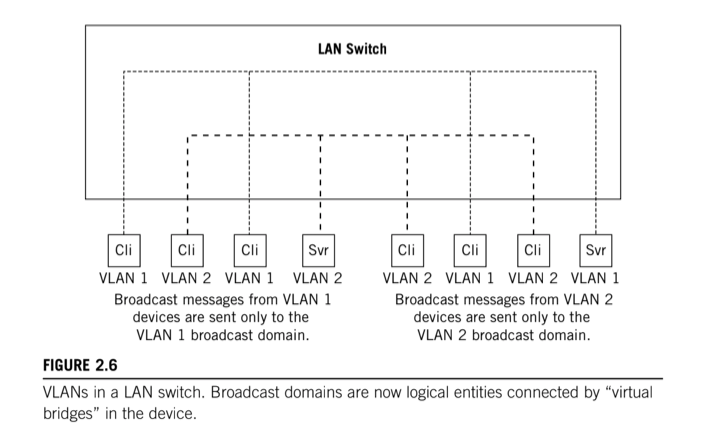
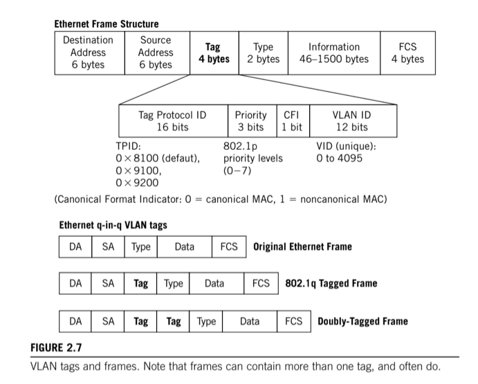

# Virtual LANs

A VLAN, according to the oficial IEEE definition, defines broadcast domains at Data Link Layer, thus having little to do with the TCP/IP protocol stack, but VLANs make a huge difference in how switches and routers operate on a TCP/IP network.

Routers do not propage broadcasts as bridges do, so a router automatically defines broadcast domains on each interface. Data Link layer LAN switches logically create broadcast domains based on configuration of the switch. The configuration tells the LAN switch what to do with a broadcast received on a port in terms of what others port should receive it.

When LAN switches are used to connect LAN segments, the broadcast domains cannot be determined just by looking at the network diagram. System can belong to different, same, or even multiple, broadcast domains. Each broadcast domain is a type of "virtual bridge" within the switch, that establishes a disctinct broadcast domain, or VLAN. Frames fron one VLAN cannot pass directly to another VLAN or the LAN switch.

## VLAN Frame Tagging

VLAN devices can come in all shapes and sizes, and configuration of the broadcast domains can be just as variable. Interopoerability of LAN switches is comrpmised when there are multiple ways for a device to recognize the boundaries of broadcast domains. To promote interoperability, the IEEE established IEEE 802.1Q to __standardize the creation of VLANs__ through the use of __frame tagging__.

## Why VLANs

VLANs are built for a variety of reasons:

### Security

Frames on an Ethernet segment are delivered everywhere, and devices only process MAC frames that are addressed to them. Nothing stops a device from monitoring everything that arrives on the interface. Sensitive information, or departmental traffic, can be isolated with virtual LANs.

### Cutting down on broadcasts

Some network protocols are much worse than others when it comes to broadcasts. These broadcast frames can be an issue because they rarely carry user data and each and every system on the segment must process the content of a broadcast frame. VLANs can isolate protocol broadcasts so that they arrive only at the systems that need to hear them. Also, a number of hosts that might otherwise make up a very large logical network could use VLANs because they can be just plain noisy.

### Router delay

Older routers can be much slower than LAN switches. VLANs can be used to establish logical boundaries that do not need to employ a router to get traffic from one LAN segment to another.
